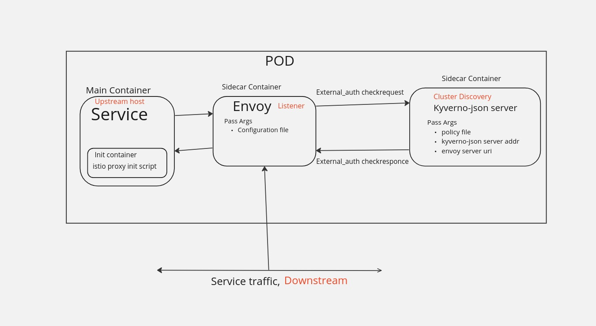
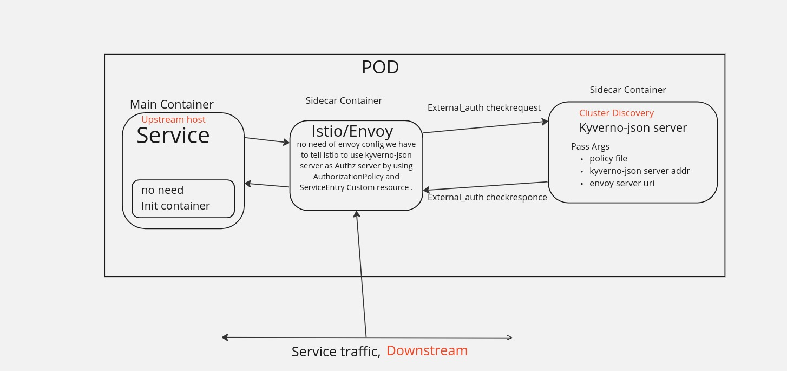

# Istio Demo 

This Istio Demo is prototype of the kyverno envoy plugin.

## Overview 

The goal of the demo to show user how kyverno-envoy-plugin will work with istio and how it can be used to enforce policies to the traffic between services. The Kyverno-envoy-plugin allows configuring these Envoy proxies to query Kyverno-json for policy decisions on incoming requests.

## Demo instructions

### Required tools

1. [`kind`](https://kind.sigs.k8s.io/)
1. [`kubectl`](https://kubernetes.io/docs/tasks/tools/install-kubectl/)
1. [`helm`](https://helm.sh/docs/intro/install/)

### Create a local cluster and install Istio

The [bootstrap.sh](bootstrap.sh) script contains everything needed to create a local cluster and install Istio.

```console
# create a local cluster and install istio
./bootstrap.sh
```

### Sample application

Manifests for the sample application are available in [sample-application.yaml](manifests/sample-application.yaml).

```console
# deploy sample application
kubectl apply -f ./manifests/sample-application.yaml
```

### Calling the sample application

We are going to call the sample application using a pod in the cluster.

```console
kubectl run test -it --rm --restart=Never --image=busybox -- wget -q --output-document - echo.demo.svc.cluster.local:8080/foo

{
  "path": "/foo",
  "headers": {
    "host": "echo.demo.svc.cluster.local:8080",
    "user-agent": "Wget",
    "x-forwarded-proto": "http",
    "x-request-id": "1badcd84-75eb-4911-9835-b3588e3c5eee",
    "x-b3-traceid": "904f847c3db71758fa4076e48440800a",
    "x-b3-spanid": "fa4076e48440800a",
    "x-b3-sampled": "0"
  },
  "method": "GET",
  "body": "",
  "fresh": false,
  "hostname": "echo.demo.svc.cluster.local",
  "ip": "::ffff:127.0.0.6",
  "ips": [],
  "protocol": "http",
  "query": {},
  "subdomains": [
    "svc",
    "demo",
    "echo"
  ],
  "xhr": false,
  "os": {
    "hostname": "echo-6847f9f85-wbgbx"
  },
  "connection": {}
}
```

### Authorization policy

Now we can deploy an istio `AuthorizationPolicy`:

```console
# deploy authorisation policy
kubectl apply -f - <<EOF
apiVersion: security.istio.io/v1
kind: AuthorizationPolicy
metadata:
  name: ext-authz
  namespace: demo
spec:
  action: CUSTOM
  provider:
    name: kyverno-ext-authz-http
  rules:
  - to:
    - operation:
        paths: ["/foo"]
EOF
```

This policy configures an external service for authorization. Note that the service is not specified directly in the policy but using a `provider.name` field.

The provider will be registered later in the istio config map.

### Calling the sample application again

Calling the sample application again at the `/foo` path will return `403 Forbidden`.

```console
kubectl run test -it --rm --restart=Never --image=busybox -- wget -q --output-document - echo.demo.svc.cluster.local:8080/foo
wget: server returned error: HTTP/1.1 403 Forbidden
```

Note that calling another path (like `/bar`) succeeds as it's not part of the policy.

```console
kubectl run test -it --rm --restart=Never --image=busybox -- wget -q --output-document - echo.demo.svc.cluster.local:8080/bar

{
  "path": "/bar",
  "headers": {
    "host": "echo.demo.svc.cluster.local:8080",
    "user-agent": "Wget",
    "x-forwarded-proto": "http",
    "x-request-id": "ca22cf4c-fd28-4dff-94a1-bc0611d710a4",
    "x-b3-traceid": "202ef8abae854851c12c033ff52252e4",
    "x-b3-spanid": "c12c033ff52252e4",
    "x-b3-sampled": "0"
  },
  "method": "GET",
  "body": "",
  "fresh": false,
  "hostname": "echo.demo.svc.cluster.local",
  "ip": "::ffff:127.0.0.6",
  "ips": [],
  "protocol": "http",
  "query": {},
  "subdomains": [
    "svc",
    "demo",
    "echo"
  ],
  "xhr": false,
  "os": {
    "hostname": "echo-6847f9f85-wbgbx"
  },
  "connection": {}
}
```

### Register authorization provider

TODO

### Authorization service

TODO

### Calling the sample application again

TODO

## Architecture

The below architecture illustrates a scenario where no service mesh or Envoy-like components have been pre-installed or already installed.



The below architecture illustrates a scenario where a service mesh or Envoy-like components have been pre-installed or already installed.


## Requirements

- Istio Authorizationpolicy manifest  to add "extension provider " concept in MeshConfig to specify Where/how to talk to envoy ext-authz service 
-
