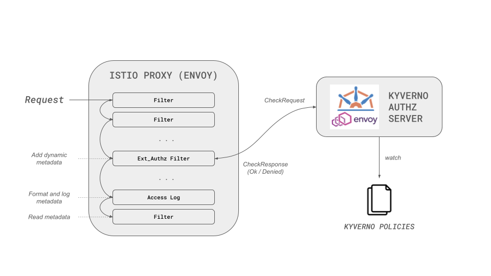

# Envoy Policy Breakdown

This guide provides a comprehensive breakdown of how to write `ValidatingPolicy` resources for Envoy proxy authorization.

## Overview

When using the Kyverno Authz Server with Envoy, policies analyze Envoy [CheckRequest](https://www.envoyproxy.io/docs/envoy/latest/api-v3/service/auth/v3/external_auth.proto#service-auth-v3-checkrequest) objects and return [CheckResponse](https://www.envoyproxy.io/docs/envoy/latest/api-v3/service/auth/v3/external_auth.proto#service-auth-v3-checkresponse) decisions.

The Kyverno Authz Server implements the [Envoy External Authorization](https://www.envoyproxy.io/docs/envoy/latest/intro/arch_overview/security/ext_authz_filter) API.

## Policy Structure

A Kyverno `ValidatingPolicy` for Envoy consists of:

1. **Evaluation Mode**: Must be set to `Envoy`
2. **Failure Policy**: How to handle policy evaluation failures
3. **Match Conditions** (optional): Fine-grained request filtering
4. **Variables** (optional): Reusable expressions
5. **Validation Rules**: Authorization logic

## Evaluation Mode

For Envoy integration, the evaluation mode **must** be set to `Envoy`:

```yaml
apiVersion: policies.kyverno.io/v1alpha1
kind: ValidatingPolicy
metadata:
  name: envoy-policy
spec:
  evaluation:
    mode: Envoy  # Required for Envoy integration
  validations:
  - expression: ...
```

## Failure Policy

The `failurePolicy` defines how to handle failures during policy evaluation (parse errors, type check errors, runtime errors).

Allowed values:
- `Fail` (default): Deny the request if policy evaluation fails
- `Ignore`: Allow the request if policy evaluation fails

### Example: Fail Policy

```yaml
apiVersion: policies.kyverno.io/v1alpha1
kind: ValidatingPolicy
metadata:
  name: demo
spec:
  failurePolicy: Fail  # Deny on failure
  evaluation:
    mode: Envoy
  variables:
  - name: force_authorized
    expression: object.attributes.request.http.headers[?"x-force-authorized"].orValue("")
  - name: allowed
    expression: variables.force_authorized in ["enabled", "true"]
  validations:
  - expression: >
      !variables.allowed
        ? envoy.Denied(403).Response()
        : null
```

### Example: Ignore Policy

```yaml
apiVersion: policies.kyverno.io/v1alpha1
kind: ValidatingPolicy
metadata:
  name: demo
spec:
  failurePolicy: Ignore  # Allow on failure
  evaluation:
    mode: Envoy
  variables:
  - name: force_authorized
    expression: object.attributes.request.http.headers[?"x-force-authorized"].orValue("")
  - name: allowed
    expression: variables.force_authorized in ["enabled", "true"]
  validations:
  - expression: >
      !variables.allowed
        ? envoy.Denied(403).Response()
        : null
```

## Match Conditions

Match conditions provide fine-grained request filtering using CEL expressions. All match conditions must evaluate to `true` for the policy to apply.

!!!info
    Variables are NOT available in match conditions because they are evaluated before the rest of the policy.

### Example: Header-Based Matching

```yaml
apiVersion: policies.kyverno.io/v1alpha1
kind: ValidatingPolicy
metadata:
  name: demo
spec:
  failurePolicy: Fail
  evaluation:
    mode: Envoy
  matchConditions:
  - name: has-header
    expression: object.attributes.request.http.headers[?"x-force-deny"].hasValue()
  validations:
  - expression: >
      envoy.Denied(403).Response()
```

In this example:
- If the request has the `x-force-deny` header, the policy applies and denies the request
- If the request doesn't have the header, the policy is skipped

### Error Handling

If a match condition evaluation fails:
1. If any match condition evaluated to `false`, the policy is skipped
2. Otherwise:
   - For `failurePolicy: Fail`: Reject the request
   - For `failurePolicy: Ignore`: Skip the policy and allow the request

## Variables

Variables are named CEL expressions that can be reused throughout the policy. They are available under the `variables` identifier.

!!!info
    The incoming Envoy `CheckRequest` is available under the `object` identifier.

### Example: Using Variables

```yaml
apiVersion: policies.kyverno.io/v1alpha1
kind: ValidatingPolicy
metadata:
  name: demo
spec:
  failurePolicy: Fail
  evaluation:
    mode: Envoy
  variables:
    # Extract header value
  - name: force_authorized
    expression: object.attributes.request.http.headers[?"x-force-authorized"].orValue("")
    # Compute authorization status
  - name: allowed
    expression: variables.force_authorized in ["enabled", "true"]
  validations:
  - expression: >
      !variables.allowed
        ? envoy.Denied(403).Response()
        : envoy.Allowed().Response()
```

**Important**: Variables must be sorted by order of first appearance. A variable can reference earlier variables but not later ones.

## Validation Rules

Validation rules contain the authorization logic. Each rule is a CEL expression that returns either a `CheckResponse` or `null`.

### Evaluation Order

1. Rules are evaluated sequentially in the order they appear
2. If a rule returns a `CheckResponse` (non-null), that response is returned immediately
3. If a rule returns `null`, evaluation continues to the next rule
4. If all rules return `null`, the request is allowed by default

### Basic Example

```yaml
apiVersion: policies.kyverno.io/v1alpha1
kind: ValidatingPolicy
metadata:
  name: demo
spec:
  failurePolicy: Fail
  evaluation:
    mode: Envoy
  variables:
  - name: force_authorized
    expression: object.attributes.request.http.headers[?"x-force-authorized"].orValue("")
  - name: allowed
    expression: variables.force_authorized in ["enabled", "true"]
  validations:
  - expression: >
      !variables.allowed
        ? envoy.Denied(403).Response()
        : envoy.Allowed().Response()
```

### Advanced Example

This example demonstrates multiple validation checks with custom headers and metadata:

```yaml
apiVersion: policies.kyverno.io/v1alpha1
kind: ValidatingPolicy
metadata:
  name: demo
spec:
  evaluation:
    mode: Envoy
  variables:
  - name: force_authorized
    expression: object.attributes.request.http.headers[?"x-force-authorized"].orValue("") in ["enabled", "true"]
  - name: force_unauthenticated
    expression: object.attributes.request.http.headers[?"x-force-unauthenticated"].orValue("") in ["enabled", "true"]
  - name: metadata
    expression: '{"my-new-metadata": "my-new-value"}'
  validations:
    # Check 1: Return 401 if unauthenticated
  - expression: >
      variables.force_unauthenticated
        ? envoy
            .Denied(401)
            .WithBody("Authentication Failed")
            .Response()
        : null
    # Check 2: Return 403 if not authorized
  - expression: >
      !variables.force_authorized
        ? envoy
            .Denied(403)
            .WithBody("Unauthorized Request")
            .Response()
        : null
    # Check 3: Allow with custom headers and metadata
  - expression: >
      envoy
        .Allowed()
        .WithHeader("x-validated-by", "my-security-checkpoint")
        .WithoutHeader("x-force-authorized")
        .WithResponseHeader("x-add-custom-response-header", "added")
        .Response()
        .WithMetadata(variables.metadata)
```

This policy demonstrates:
- **Sequential evaluation**: Each validation is checked in order
- **Conditional responses**: Using ternary operators to return responses or null
- **Request header manipulation**: Adding and removing headers
- **Response headers**: Adding headers to the response
- **Custom body**: Setting response body content
- **Dynamic metadata**: Passing data to other Envoy filters

## CEL Envoy Extension Library

The CEL engine includes helper functions for creating Envoy responses:

### Key Functions

- **`envoy.Allowed()`**: Creates an OK response
- **`envoy.Denied(statusCode)`**: Creates a denied response with a status code
- **`.WithHeader(key, value)`**: Adds a request header
- **`.WithoutHeader(key)`**: Removes a request header
- **`.WithResponseHeader(key, value)`**: Adds a response header
- **`.WithBody(content)`**: Sets the response body
- **`.Response()`**: Converts to a CheckResponse
- **`.WithMetadata(data)`**: Adds dynamic metadata to the Envoy filter chain

### Manual Response Creation

You can also create responses manually without helper functions:

```yaml
apiVersion: policies.kyverno.io/v1alpha1
kind: ValidatingPolicy
metadata:
  name: demo
spec:
  failurePolicy: Fail
  evaluation:
    mode: Envoy
  variables:
  - name: force_authorized
    expression: object.attributes.request.http.headers[?"x-force-authorized"].orValue("")
  - name: allowed
    expression: variables.force_authorized in ["enabled", "true"]
  validations:
  - expression: >
      !variables.allowed
        ? envoy.DeniedResponse{
            status: google.rpc.Status{
              code: 7
            },
            http_response: envoy.service.auth.v3.DeniedHttpResponse{
              status: envoy.type.v3.HttpStatus{
                code: 403
              }
            }
          }
        : envoy.OkResponse{
            status: google.rpc.Status{
              code: 0
            },
            http_response: envoy.service.auth.v3.OkHttpResponse{}
          }
```

## Dynamic Metadata

Dynamic metadata can be passed along the Envoy filter chain, useful for:
- Passing data to other filters
- Including in application logs
- Making decisions in downstream filters



```yaml
validations:
- expression: >
    envoy
      .Allowed()
      .Response()
      .WithMetadata({"user": "john", "role": "admin"})
```

## Complete Example

Here's a complete policy that combines all concepts:

```yaml
apiVersion: policies.kyverno.io/v1alpha1
kind: ValidatingPolicy
metadata:
  name: complete-envoy-policy
spec:
  failurePolicy: Fail
  evaluation:
    mode: Envoy
  matchConditions:
  - name: is-api-path
    expression: object.attributes.request.http.path.startsWith("/api/")
  variables:
  - name: auth_header
    expression: object.attributes.request.http.headers[?"authorization"].orValue("")
  - name: is_authenticated
    expression: variables.auth_header.startsWith("Bearer ")
  - name: user_role
    expression: object.attributes.request.http.headers[?"x-user-role"].orValue("guest")
  - name: is_admin
    expression: variables.user_role == "admin"
  validations:
  # Deny if not authenticated
  - expression: >
      !variables.is_authenticated
        ? envoy.Denied(401).WithBody("Authentication required").Response()
        : null
  # Deny if not admin
  - expression: >
      !variables.is_admin
        ? envoy.Denied(403).WithBody("Admin access required").Response()
        : null
  # Allow with tracking headers
  - expression: >
      envoy
        .Allowed()
        .WithHeader("x-auth-validated", "true")
        .WithResponseHeader("x-policy-applied", "complete-envoy-policy")
        .Response()
        .WithMetadata({"policy": "complete-envoy-policy", "role": variables.user_role})
```

## Best Practices

1. **Use specific match conditions** to avoid policy conflicts when multiple policies exist
2. **Order validations carefully** - put most common deny conditions first
3. **Use variables** to avoid repeating complex expressions
4. **Return `null`** from validations that don't make a decision
5. **Set appropriate failure policies** based on your security requirements
6. **Add metadata** for observability and debugging
7. **Use descriptive policy names** for easier troubleshooting

## Additional Resources

- [CEL Envoy Extension Library](../cel-extensions/envoy.md)
- [CEL Language Specification](https://github.com/google/cel-spec)
- [Envoy External Authorization](https://www.envoyproxy.io/docs/envoy/latest/intro/arch_overview/security/ext_authz_filter)
- [Envoy CheckRequest API](https://www.envoyproxy.io/docs/envoy/latest/api-v3/service/auth/v3/external_auth.proto#service-auth-v3-checkrequest)
