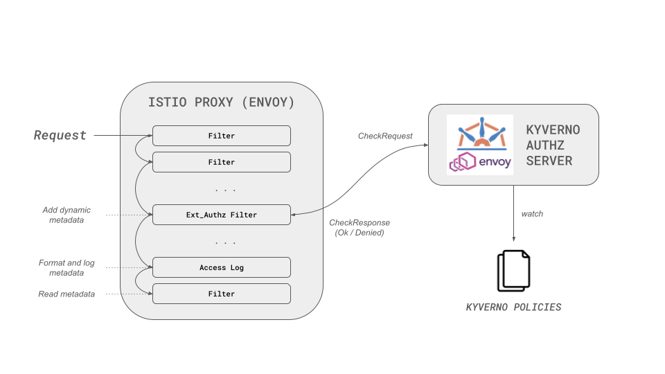

# Validation rules

An `ValidatingPolicy` main concern is to define `validations` rules to deny or allow requests.

Every validation rule is made of an `expression` statement written in [CEL](https://github.com/google/cel-spec).

The `expression` statement is used to create the response payload returned to the envoy proxy.
Depending on the rule type, the response is expected to be an [OkResponse](../../cel-extensions/envoy.md#okresponse), a [DeniedResponse](../../cel-extensions/envoy.md#deniedresponse), or `null`.

!!!info
    When an expression returns `null`, the Kyverno Authz Server assumes that the expression doesn't want to make a decision and moves to the next validation rule.

## CEL envoy extension

Creating an [OkResponse](../../cel-extensions/envoy.md#okresponse) or [DeniedResponse](../../cel-extensions/envoy.md#deniedresponse) can be a tedious task, you need to remember the different types names and format.

The CEL engine used to evaluate the authorization rules has been extended with a library to make the creation of responses easier. Browse the [available libraries documentation](../../cel-extensions/index.md) for details.

## Evaluation order

When multiple policies are present, policies are sorted in **alphabetical order** against their name.

The Kyverno Authz Server then processes policies in sequential order and for each policy:

1. All `validations` rules are evaluated in the same order they are defined. The first rule returning a non null result is used to send the response to the envoy proxy.
1. If all rules return a non null result, the request is allowed by default.

## Validation rules

The policy below will allow requests if they contain the header `x-force-authorized` with the value `enabled` or `true`.
If the header is not present or has a different value, the request will be denied.

```yaml
apiVersion: policies.kyverno.io/v1alpha1
kind: ValidatingPolicy
metadata:
  name: demo
spec:
  failurePolicy: Fail
  evaluation:
    mode: Envoy
  variables:
  - name: force_authorized
    expression: object.attributes.request.http.headers[?"x-force-authorized"].orValue("")
  - name: allowed
    expression: variables.force_authorized in ["enabled", "true"]
  # make an authorisation decision based on the value of `variables.allowed`
  # - deny the request with 403 status code if it is `false`
  # - else allow the request
  validations:
  - expression: >
      !variables.allowed
        ? envoy.Denied(403).Response()
        : envoy.Allowed().Response()
```

In this simple rule:

- `envoy.Allowed().Response()`

    Creates an `OkResponse` to allow the request

- `envoy.Denied(403).Response()`

    Creates a `DeniedResponse` to deny the request with status code `403`

However, we can do a lot more.
Envoy can add or remove headers, query parameters, register dynamic metadata passed along the filters chain, and even change the response body.



### The hard way

Below is the same policy, creating the `envoy.OkResponse` and `envoy.DeniedResponse` manually.

```yaml
apiVersion: policies.kyverno.io/v1alpha1
kind: ValidatingPolicy
metadata:
  name: demo
spec:
  failurePolicy: Fail
  evaluation:
    mode: Envoy
  variables:
  - name: force_authorized
    expression: object.attributes.request.http.headers[?"x-force-authorized"].orValue("")
  - name: allowed
    expression: variables.force_authorized in ["enabled", "true"]
  validations:
  - expression: >
      !variables.allowed
        ? envoy.DeniedResponse{
            status: google.rpc.Status{
              code: 7
            },
            http_response: envoy.service.auth.v3.DeniedHttpResponse{
              status: envoy.type.v3.HttpStatus{
                code: 403
              }
            }
          }
        : envoy.OkResponse{
            status: google.rpc.Status{
              code: 0
            },
            http_response: envoy.service.auth.v3.OkHttpResponse{}
          }
```

### Advanced example

This second policy showcases a more advanced example.

```yaml
apiVersion: policies.kyverno.io/v1alpha1
kind: ValidatingPolicy
metadata:
  name: demo
spec:
  evaluation:
    mode: Envoy
  variables:
  - name: force_authorized
    expression: object.attributes.request.http.headers[?"x-force-authorized"].orValue("") in ["enabled", "true"]
  - name: force_unauthenticated
    expression: object.attributes.request.http.headers[?"x-force-unauthenticated"].orValue("") in ["enabled", "true"]
  - name: metadata
    expression: '{"my-new-metadata": "my-new-value"}'
  validations:
    # if force_unauthenticated -> 401
  - expression: >
      variables.force_unauthenticated
        ? envoy
            .Denied(401)
            .WithBody("Authentication Failed")
            .Response()
        : null
    # if not force_authorized -> 403
  - expression: >
      !variables.force_authorized
        ? envoy
            .Denied(403)
            .WithBody("Unauthorized Request")
            .Response()
        : null
    # else -> 200
  - expression: >
      envoy
        .Allowed()
        .WithHeader("x-validated-by", "my-security-checkpoint")
        .WithoutHeader("x-force-authorized")
        .WithResponseHeader("x-add-custom-response-header", "added")
        .Response()
        .WithMetadata(variables.metadata)
```

Notice this policy uses helper functions:

- [envoy.Allowed](../../cel-extensions/envoy.md#envoyallowed)

    To create an OK http response

- [envoy.Denied](../../cel-extensions/envoy.md#envoydenied)

    To create a DENIED http response

- [Response](../../cel-extensions/envoy.md#response)

    To create a check response from an http response

- [WithHeader](../../cel-extensions/envoy.md#withheader)

    To add a request header

- [WithoutHeader](../../cel-extensions/envoy.md#withoutheader)

    To remove a request header

- [WithResponseHeader](../../cel-extensions/envoy.md#withresponseheader)

    To add a response header

- [WithBody](../../cel-extensions/envoy.md#withbody)

    To modify the response body

- [WithMetadata](../../cel-extensions/envoy.md#withmetadata)

    To add dynamic metadata in the envoy filter chain (this is useful when you want to pass data to another filter in the chain or you want to print it in the application logs)

!!!info

    The full documentation of the CEL Envoy library is available [here](../../cel-extensions/envoy.md).