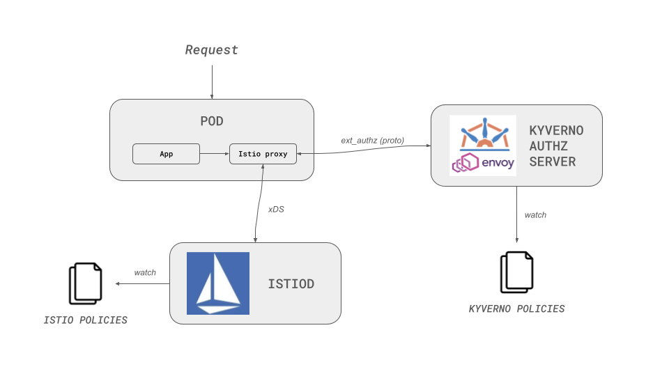

# Quick start

The Kyverno HTTP Authorizer is a powerful authorization service that validates HTTP requests using policy-based rules written in CEL (Common Expression Language).

It provides fine-grained, context-aware access control for your applications.

## Overview 

Modern applications need flexible authorization mechanisms that can evaluate requests based on headers, paths, methods, and external data sources. The Kyverno HTTP Authorizer provides this capability by accepting vanilla HTTP requests and returning custom responses based on policy evaluation.

The authorizer integrates with HTTP proxies and ingress controllers (like Ingress NGINX) using standard external authentication protocols. Applications can also call the authorizer directly via HTTP, though this requires code changes to integrate the authorization check.

## What is the Kyverno HTTP Authorizer?

The [Kyverno HTTP Authorizer](https://github.com/kyverno/kyverno-http-authorizer) is an HTTP/gRPC authorization server that validates requests against Kyverno policies defined using CEL expressions.

Key features include:

- **Policy-based authorization**: Define authorization rules using CEL expressions that can evaluate request attributes (headers, paths, methods, etc.)
- **External data integration**: Fetch data from HTTP services or Kubernetes resources (ConfigMaps, Secrets) to make authorization decisions
- **Sidecar deployment**: Runs as a sidecar container alongside your applications or proxies for low-latency authorization checks
- **Control plane architecture**: Centralized policy management with distributed enforcement through sidecars
- **Vanilla HTTP interface**: Accepts standard HTTP requests and returns custom HTTP responses based on policy evaluation
- **Integration with proxies**: Works with Ingress NGINX and other proxies that support external authentication

## How does this work?

The Kyverno HTTP Authorizer uses a control plane and sidecar architecture:

1. **Control Plane**: Manages ValidatingPolicy resources and distributes them to sidecars
2. **Sidecar Injector**: Automatically injects authorization sidecars into pods via a mutating webhook
3. **Authorization Sidecar**: Runs alongside your proxy/application and validates HTTP requests against policies

### Request Flow

When an HTTP request needs authorization:

1. The proxy (e.g., Ingress NGINX) or application sends a vanilla HTTP request to the authorization sidecar on localhost
2. The sidecar receives the request details (host, path, headers, method, etc.)
3. The sidecar evaluates the request against policies received from the control plane
4. Based on the policy evaluation, the sidecar returns a custom HTTP response:
   - **Allow**: Returns 200 with optional custom headers and response body
   - **Deny**: Returns a custom status code (e.g., 403, 401) with a custom response body

The policies can fetch external data (from HTTP services or Kubernetes resources) to make authorization decisions, enabling dynamic and context-aware access control.

Performing policy evaluations locally in the sidecar is advantageous, as it eliminates the need for an additional network hop for authorization checks, thus enhancing both performance and availability.

!!!info

    The Kyverno HTTP Authorizer is designed for Kubernetes environments where sidecars are automatically injected into pods. It can also be deployed as a standalone service for non-Kubernetes environments.

## Additional Resources 

See the following resources to learn more:

- [Kyverno CEL Libraries](https://kyverno.io/docs/policy-types/cel-libraries/) to learn about available CEL functions for policies
- [Tutorials](../tutorials/) for step-by-step guides on integrating with Ingress NGINX and Gateway API
- [Installation Guide](../install/certificates.md) for certificate management and deployment options

