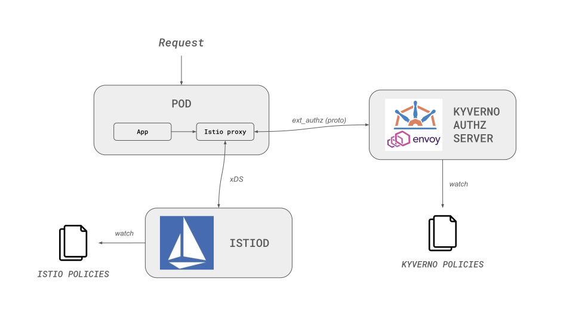
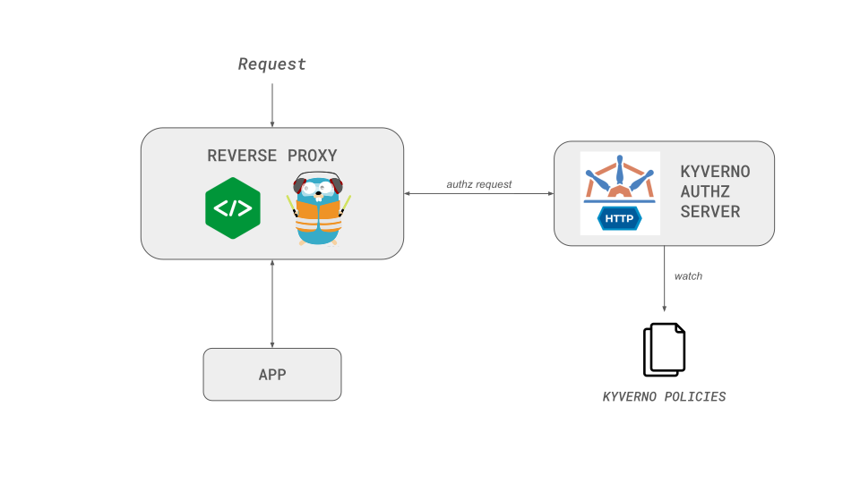

# Getting Started

The **Kyverno Authz Server** provides programmable and flexible, policy-based authorization for **Envoy proxies** and **HTTP services**.

It uses **Kyverno policies** written in **CEL (Common Expression Language)** to deliver fine-grained, context-aware access control and make a decision given an input request description.

!!! info
    The Kyverno Authz Server runs seamlessly in Kubernetes or as a standalone service outside Kubernetes environments.

## Key Capabilities

- **Dual-mode operation** – Works with Envoy (gRPC) or standalone HTTP services
- **Programmable** – Adapts to the underlying protocol (NGINX, Traefik, ...)
- **Policy-driven authorization** – Write policies using CEL with your decision logic for fast evaluation
- **External data integration** – Query HTTP services, fetch Kubernetes resources or OCI images data for decision-making
- **Lightweight sidecar model** – Low-latency local enforcement with centralized policy management

## How It Works

### Envoy Integration

Connects with [Envoy’s External Authorization filter](https://www.envoyproxy.io/docs/envoy/latest/intro/arch_overview/security/ext_authz_filter.html) via gRPC.

Envoy sends authorization requests to the Kyverno sidecar, which evaluates policies and returns allow/deny decisions.

### HTTP Authorization

Runs as a programmable HTTP server that evaluates requests directly and returns a decision — ideal for ingress controllers or standalone services.

## Get Started

- **[Envoy Hello World](../hello-world/envoy.md)** – Introduction to the Envoy Authz Server
- **[HTTP Hello World](../hello-world/http.md)** – Introduction to the HTTP Authz Server
- **[Sidecar Injector](./sidecar-injector.md)** – Automate sidecar injection
