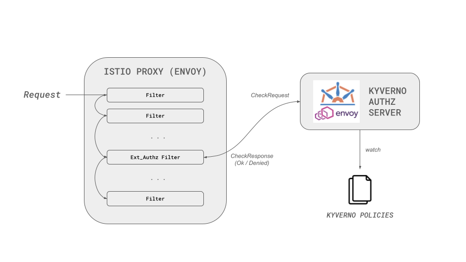

# Quick Start

The Kyverno Envoy Plugin is a flexible authorization service that enforces Kyverno policies for **Envoy proxies** and **plain HTTP services**. It provides fine-grained, context-aware access control using policy-based rules written in CEL (Common Expression Language).

## Overview 

Modern applications need flexible authorization mechanisms that can evaluate requests based on headers, paths, methods, and external data sources. The Kyverno Envoy Plugin provides this capability in two modes:

### 🔌 Envoy Integration

Integrates with [Envoy](https://www.envoyproxy.io/docs/envoy/latest/intro/what_is_envoy)'s [External Authorization filter](https://www.envoyproxy.io/docs/envoy/latest/intro/arch_overview/security/ext_authz_filter.html) (v1.7.0+) to make authorization decisions for service mesh and API gateway deployments. The plugin implements the Envoy External Authorization API as a gRPC server, allowing authorization decisions to be offloaded to an external service that can access the full request context.

### 🌐 HTTP Authorization

Works as a standalone HTTP authorization server that accepts vanilla HTTP requests and returns custom responses based on policy evaluation. This mode integrates with HTTP proxies and ingress controllers (like Ingress NGINX) using standard external authentication protocols, or can be called directly by applications.

## What is the Kyverno Envoy Plugin?

The [Kyverno Envoy Plugin](https://github.com/kyverno/kyverno-envoy-plugin) is an HTTP/gRPC authorization server that validates requests against Kyverno policies defined using CEL expressions.

### Key Features

- **Dual-mode operation**: Works with Envoy proxies (gRPC) or plain HTTP services
- **Policy-based authorization**: Define authorization rules using CEL expressions that evaluate request attributes (headers, paths, methods, etc.)
- **External data integration**: Fetch data from HTTP services or Kubernetes resources (ConfigMaps, Secrets) to make authorization decisions
- **Control plane architecture**: Centralized policy management with distributed enforcement through sidecars
- **Sidecar deployment**: Runs as a sidecar container alongside your applications or proxies for low-latency authorization checks
- **No code changes required**: Enforce policies without modifying your microservices
- **Dynamic responses**: Return custom status codes, headers, and response bodies based on policy evaluation

## How Does This Work?

The Kyverno Envoy Plugin uses a control plane and sidecar architecture:

1. **Control Plane**: Manages `ValidatingPolicy` resources and distributes them to authorization sidecars
2. **Sidecar Injector**: Automatically injects authorization sidecars into pods via a mutating webhook
3. **Authorization Sidecar**: Runs alongside your proxy/application and validates requests against policies

### Request Flow

#### Envoy Mode

When Envoy receives an API request:

1. Envoy's External Authorization filter sends a gRPC CheckRequest to the Kyverno Authz Server sidecar
2. The sidecar evaluates the request against policies (evaluation mode: `Envoy`)
3. The sidecar returns a CheckResponse with the authorization decision
4. Envoy either forwards the request to your microservice or denies it based on the response

#### HTTP Mode

When an HTTP request needs authorization:

1. The proxy (e.g., Ingress NGINX) or application sends a vanilla HTTP request to the authorization sidecar on localhost
2. The sidecar receives the request details (host, path, headers, method, etc.)
3. The sidecar evaluates the request against policies (evaluation mode: `HTTP`)
4. Based on the policy evaluation, the sidecar returns a custom HTTP response:
   - **Allow**: Returns 200 with optional custom headers and response body
   - **Deny**: Returns a custom status code (e.g., 403, 401) with a custom response body

Performing policy evaluations locally in the sidecar is advantageous, as it eliminates the need for an additional network hop for authorization checks, thus enhancing both performance and availability.

!!!info

    The Kyverno Envoy Plugin is designed for Kubernetes environments where sidecars are automatically injected into pods. It can also be deployed as a standalone service for non-Kubernetes environments or run alongside Envoy as a separate process.

## Getting Started

Choose your deployment mode:

- **[Envoy Integration Guide](./envoy.md)** - Set up authorization for Envoy proxy and service mesh
- **[HTTP Authorization Guide](./http.md)** - Set up authorization for HTTP services and ingress controllers
- **[Sidecar Injector](./sidecar-injector.md)** - Automatically inject authorization sidecars into pods

## Writing Policies

Learn how to write authorization policies:

- **[Envoy Policy Breakdown](../policies/envoy-policy-breakdown.md)** - Complete guide for Envoy policies
- **[HTTP Policy Breakdown](../policies/http-policy-breakdown.md)** - Complete guide for HTTP policies

## Additional Resources 

### For Envoy Integration

- [External Authorization](https://www.envoyproxy.io/docs/envoy/latest/intro/arch_overview/security/ext_authz_filter.html) - Learn about the External Authorization filter
- [Network](https://www.envoyproxy.io/docs/envoy/latest/configuration/listeners/network_filters/ext_authz_filter#config-network-filters-ext-authz) and [HTTP](https://www.envoyproxy.io/docs/envoy/latest/configuration/http/http_filters/ext_authz_filter#config-http-filters-ext-authz) - Configure the External Authorization filter

### For HTTP Authorization

- [Kyverno CEL Libraries](https://kyverno.io/docs/policy-types/cel-libraries/) - Available CEL functions for policies
- [Installation Guide](../install/certificates.md) - Certificate management and deployment options

### General

- [Next Steps](./next-steps.md) - Continue your journey with the Kyverno Envoy Plugin

