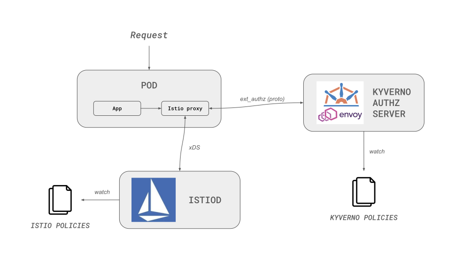

# Envoy Authz Server

[Envoy](https://www.envoyproxy.io/docs/envoy/latest/intro/what_is_envoy) is a Layer 7 proxy and communication bus tailored for large-scale, modern service-oriented architectures.

Starting from version 1.7.0, Envoy includes an [External Authorization filter](https://www.envoyproxy.io/docs/envoy/latest/intro/arch_overview/security/ext_authz_filter.html) that interfaces with an authorization service to determine the legitimacy of incoming requests.

This functionality allows authorization decisions to be offloaded to an external service, which can access the request context.

The request context includes details such as the origin and destination of the network activity, as well as specifics of the network request (e.g., HTTP request).

This information enables the external service to make a well-informed decision regarding the authorization of the incoming request processed by Envoy.

The Kyverno Authz Server supports the Envoy External Authorization protocol.

## Overview

The [Kyverno Authz Server](https://github.com/kyverno/kyverno-envoy-plugin) is a gRPC server that implements [Envoy External Authorization API](https://www.envoyproxy.io/docs/envoy/latest/intro/arch_overview/security/ext_authz_filter.html).

Envoy sends authorization requests to the Kyverno Authz Server, which evaluates policies and returns allow/deny decisions.

In addition to the Envoy sidecar, your application pods will include a Kyverno Authz Server component, either as a sidecar or as a separate pod.

When Envoy receives an API request intended for your microservice, it consults the Kyverno Authz Server to determine whether the request should be permitted or not.

