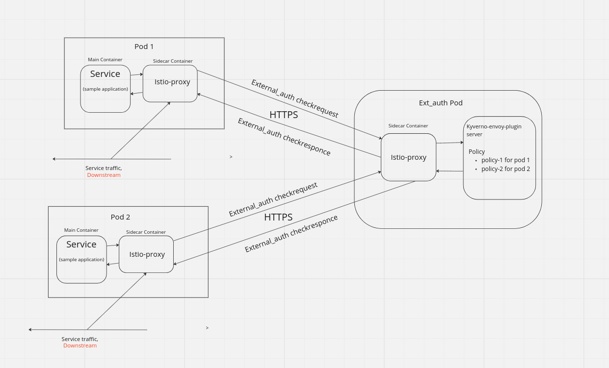

# Istio mTLS 

Istio is an open source service mesh for managing the different microservices that make up a cloud-native application. Istio provides a mechanism to use a service as an external authorizer with the [AuthorizationPolicy API](https://istio.io/latest/docs/tasks/security/authorization/authz-custom/). 

The kyverno-envoy-plugin is a custom Envoy filter that is used to intercept the incoming request to the service and validate the request using the kyverno engine. 

In this tutorial we will create a two simple microservices which are going to make external authorization to a single kyverno-envoy-plugin service as a separate pod in the mesh. With this tutorial we are going to understand how to use multiple microservices to make authorization decisions to a single ext-authz server. 



To handle multiple different requests effectively, we leverage the `match/exclude` declarations to route the specific authz-request to the appropriate validating policy within the Kyverno engine. This approach allows us to execute the right validating policy for each request, enabling efficient and targeted request processing.

### Example Policy

The following policies will be executed by the kyverno-envoy-plugin to validate incoming requests made specifically to the `testapp-1` service. By leveraging the match declarations, we ensure that these policies are executed only when the incoming request is destined for the `testapp-1` service. This targeted approach allows us to apply the appropriate validation rules and policies based on the specific service being accessed.

```yaml
apiVersion: json.kyverno.io/v1alpha1
kind: ValidatingPolicy
metadata:
  name: test-policy
spec:
  rules:
    - name: deny-external-calls-testapp-1
      match:
        any:
        - request:
            http:
                host: 'testapp-1.demo.svc.cluster.local:8080'
      assert:
        all:
        - message: "The GET method is restricted to the /book path."
          check:
            request:
                http:
                    method: 'GET'
                    path: '/book'
```
To execute the policy when the incoming request is made to `testapp-2` service we need to use the `match` declarations.

```yaml
apiVersion: json.kyverno.io/v1alpha1
kind: ValidatingPolicy
metadata:
  name: test-policy
spec:
  rules:
    - name: deny-external-calls-testapp-2
      match:
        any:
        - request:
            http:
                host: 'testapp-2.demo.svc.cluster.local:8080'
      assert:
        all:
        - message: "The GET method is restricted to the /movies path."
          check:
            request:
                http:
                    method: 'GET'
                    path: '/movie'   
```
The example json request for above payload will be like below.

```json
{
  "source": {
    "address": {
      "socketAddress": {
        "address": "10.244.0.71",
        "portValue": 33880
      }
    }
  },
  "destination": {
    "address": {
      "socketAddress": {
        "address": "10.244.0.65",
        "portValue": 8080
      }
    }
  },
  "request": {
    "time": "2024-05-20T07:52:01.566887Z",
    "http": {
      "id": "5415544797791892902",
      "method": "GET",
      "headers": {
        ":authority": "testapp-2.demo.svc.cluster.local:8080",
        ":method": "GET",
        ":path": "/movie",
        ":scheme": "http",
        "user-agent": "Wget",
        "x-forwarded-proto": "http",
        "x-request-id": "a3ad9f03-c9cd-4eab-97d1-83e90e0cee1b"
      },
      "path": "/movie",
      "host": "testapp-2.demo.svc.cluster.local:8080",
      "scheme": "http",
      "protocol": "HTTP/1.1"
    }
  },
  "metadataContext": {},
  "routeMetadataContext": {}
}
```

To enhance security, we can implement Mutual TLS (mTLS) for peer authentication between test services and kyverno-envoy-plugin. Since we are currently using JSON request data to validate incoming requests, there is a potential risk of this data being tampered with during transit. Implementing mTLS would ensure that communication between services is encrypted and authenticated, mitigating the risk of unauthorized data modification.

```yaml
apiVersion: security.istio.io/v1beta1
kind: PeerAuthentication
metadata:
  name: mtls-demo
  namespace: demo
spec:
  mtls:
    mode: STRICT
---
apiVersion: security.istio.io/v1beta1
kind: PeerAuthentication
metadata:
  name: mtls-testapp-1
  namespace: demo
spec:
  selector:
    matchLabels:
      app: testapp-1
  mtls:
    mode: STRICT
  portLevelMtls:
    8080:
      mode: PERMISSIVE
---
apiVersion: security.istio.io/v1beta1
kind: PeerAuthentication
metadata:
  name: mtls-testapp-2
  namespace: demo
spec:
  selector:
    matchLabels:
      app: testapp-2
  mtls:
    mode: STRICT
  portLevelMtls:
    8080:
      mode: PERMISSIVE
```
## Demo instructions

### Required tools

1. [`kind`](https://kind.sigs.k8s.io/)
1. [`kubectl`](https://kubernetes.io/docs/tasks/tools/install-kubectl/)
1. [`helm`](https://helm.sh/docs/intro/install/)

### Create a local cluster and install Istio

The tutorial also requries istio v1.19.0 or later. To install istio, follow the instructions [here](https://istio.io/latest/docs/setup/getting-started/) or run the below script it will create a kind cluster and install istio

```sh
#!/bin/bash

KIND_IMAGE=kindest/node:v1.29.2
ISTIO_REPO=https://istio-release.storage.googleapis.com/charts
ISTIO_NS=istio-system

# Create Kind cluster
kind create cluster --image $KIND_IMAGE --wait 1m --config - <<EOF
kind: Cluster
apiVersion: kind.x-k8s.io/v1alpha4
nodes:
  - role: control-plane
    kubeadmConfigPatches:
      - |-
        kind: InitConfiguration
        nodeRegistration:
          kubeletExtraArgs:
            node-labels: "ingress-ready=true"
    extraPortMappings:
      - containerPort: 80
        hostPort: 80
        protocol: TCP
      - containerPort: 443
        hostPort: 443
        protocol: TCP
  - role: worker
EOF

# Install Istio components
helm upgrade --install istio-base       --namespace $ISTIO_NS           --create-namespace --wait --repo $ISTIO_REPO base
helm upgrade --install istiod           --namespace $ISTIO_NS           --create-namespace --wait --repo $ISTIO_REPO istiod

```

### Sample applications

Manifests for the sample applications are available in [test-application-1.yaml](manifests/test-application-1.yaml) and [test-application-2.yaml](manifests/test-application-2.yaml). The sample app `testapp-1` provides information about books in a collection and exposes APIs to get, create and delete Book resources. The sample app `testapp-2` provides information about movies in a collection and exposes APIs to get, create and delete Movie resources.

```shell
$ kubectl apply -f - <<EOF
apiVersion: v1
kind: Namespace
metadata:
  name: demo
  labels:
    istio-injection: enabled
EOF
```

```shell
# deploy sample application testapp-1 
$ kubectl apply -f - <<EOF
apiVersion: apps/v1
kind: Deployment
metadata:
  name: testapp-1
  namespace: demo
spec:
  replicas: 1
  selector:
    matchLabels:
      app: testapp-1
  template:
    metadata:
      labels:
        app: testapp-1
    spec:
      containers:
      - name: testapp-1
        image: sanskardevops/test-application:0.0.1
        ports:
        - containerPort: 8080
---
apiVersion: v1
kind: Service
metadata:
  name: testapp-1
  namespace: demo
spec:
  type: NodePort
  selector:
    app: testapp-1
  ports:
  - port: 8080
    targetPort: 8080
EOF
```

```shell
# deploy sample application testapp-2
$ kubectl apply -f - <<EOF
apiVersion: apps/v1
kind: Deployment
metadata:
  name: testapp-2
  namespace: demo
spec:
  replicas: 1
  selector:
    matchLabels:
      app: testapp-2
  template:
    metadata:
      labels:
        app: testapp-2
    spec:
      containers:
      - name: testapp-2
        image: sanskardevops/test-application-1:0.0.3
        ports:
        - containerPort: 8080
---
apiVersion: v1
kind: Service
metadata:
  name: testapp-2
  namespace: demo
spec:
  type: ClusterIP
  selector:
    app: testapp-2
  ports:
  - port: 8080
    targetPort: 8080
EOF
```

### Calling the sample applications

We are going to call the sample applications using a pod in the cluster.

```shell
$ kubectl run test -it --rm --restart=Never --image=busybox -- wget -q --output-document - testapp-1.demo.svc.cluster.local:8080/book
```

```console
[{"id":"1","bookname":"Harry Potter","author":"J.K. Rowling"},{"id":"2","bookname":"Animal Farm","author":"George Orwell"}]
pod "test" deleted
```

```shell 
$ kubectl run test -it --rm --restart=Never --image=busybox -- wget -q --output-document - testapp-2.demo.svc.cluster.local:8080/movie
```

```console
[{"id":"1","Moviename":"Inception","Actor":"Leonardo DiCaprio"},{"id":"2","Moviename":"Batman","Actor":"Jack Nicholson"}]
pod "test" deleted

```

### Register authorization provider

Edit the mesh configmap to register authorization provider with the following command:

```shell
$ kubectl edit configmap istio -n istio-system
```
In the editor, add the extension provider definitions to the mesh configmap.

```yaml
  data:
    mesh: |-   
      extensionProviders:
      - name: "kyverno-ext-authz-grpc"
        envoyExtAuthzGrpc:
          service: "ext-authz.demo.svc.cluster.local"
          port: "9000"
```

### Authorization policy

Now we can deploy an istio `AuthorizationPolicy`:
AuthorizationPolicy to tell Istio to use kyverno-envoy-plugin as the Authz Server

```shell
$ kubectl apply -f - <<EOF
apiVersion: security.istio.io/v1
kind: AuthorizationPolicy
metadata:
  name: kyverno-ext-authz-grpc
  namespace: demo
spec:
  action: CUSTOM
  provider:
    # The provider name must match the extension provider defined in the mesh config.
    name: kyverno-ext-authz-grpc
  rules:
  # The rules specify when to trigger the external authorizer.
  - to:
    - operation:
        paths: ["/book","/movie"]
EOF        
```

This policy configures an external service for authorization. Note that the service is not specified directly in the policy but using a provider.name field. The rules specify that requests to paths `/book` and `/movies`.

### Authorization service deployment 

The deployment manifest of the authorization service is available in [ext-auth-server.yaml](manifests/ext-auth-server.yaml). This deployment require policy through configmap .

Apply the policy configmap with the following command.

```shell
$ kubectl apply -f - <<EOF
apiVersion: v1
kind: ConfigMap
metadata:
  name: policy-files
  namespace: demo
data:
  policy1.yaml: |
    apiVersion: json.kyverno.io/v1alpha1
    kind: ValidatingPolicy
    metadata:
      name: test-policy
    spec:
      rules:
        - name: deny-external-calls-testapp-1
          match:
            any:
            - request:
                http:
                    host: 'testapp-1.demo.svc.cluster.local:8080'
          assert:
            all:
            - message: "The GET method is restricted to the /book path."
              check:
                request:
                    http:
                        method: 'GET'
                        path: '/book'
  policy2.yaml: |
    apiVersion: json.kyverno.io/v1alpha1
    kind: ValidatingPolicy
    metadata:
      name: test-policy
    spec:
      rules:
        - name: deny-external-calls-testapp-2
          match:
            any:
            - request:
                http:
                    host: 'testapp-2.demo.svc.cluster.local:8080'
          assert:
            all:
            - message: "The GET method is restricted to the /movies path."
              check:
                request:
                    http:
                        method: 'GET'
                        path: '/movie'                
EOF                        
```

```shell
#Deploy the kyverno external authorizer server
$ kubectl apply -f - <<EOF
apiVersion: v1
kind: Service
metadata:
  name: ext-authz
  labels:
    app: ext-authz
  namespace: demo  
spec:
  ports:
  - name: http
    port: 8000
    targetPort: 8000
  - name: grpc
    port: 9000
    targetPort: 9000
  selector:
    app: ext-authz
---
apiVersion: apps/v1
kind: Deployment
metadata:
  name: ext-authz
  namespace: demo 
spec:
  replicas: 1
  selector:
    matchLabels:
      app: ext-authz 
  template:
    metadata:
      labels:
        app: ext-authz
    spec:
      containers:
      - image: sanskardevops/plugin:0.0.29
        imagePullPolicy: IfNotPresent
        name: ext-authz
        ports:
        - containerPort: 8000
        - containerPort: 9000
        args:
        - "serve"
        - "--policy=/policies/policy1.yaml"
        - "--policy=/policies/policy2.yaml"
        volumeMounts:
        - name: policy-files
          mountPath: /policies
      volumes:
      - name: policy-files
        configMap:
          name: policy-files
EOF
```

Verify the sample external authorizer is up and running:
```shell
$ kubectl logs "$(kubectl get pod -l app=ext-authz -n demo -o jsonpath={.items..metadata.name})" -n demo -c ext-authz -f
```

```console
Starting GRPC server on Port 9000
Starting HTTP server on Port 8000
```

### Apply PeerAuthentication Policy

Apply the PeerAuthentication policy to enable mTLS for the sample applications and external authorizer.

```shell
$ kubectl apply -f - <<EOF
apiVersion: security.istio.io/v1beta1
kind: PeerAuthentication
metadata:
  name: mtls-demo
  namespace: demo
spec:
  mtls:
    mode: STRICT
---
apiVersion: security.istio.io/v1beta1
kind: PeerAuthentication
metadata:
  name: mtls-testapp-1
  namespace: demo
spec:
  selector:
    matchLabels:
      app: testapp-1
  mtls:
    mode: STRICT
  portLevelMtls:
    8080:
      mode: PERMISSIVE
---
apiVersion: security.istio.io/v1beta1
kind: PeerAuthentication
metadata:
  name: mtls-testapp-2
  namespace: demo
spec:
  selector:
    matchLabels:
      app: testapp-2
  mtls:
    mode: STRICT
  portLevelMtls:
    8080:
      mode: PERMISSIVE
EOF
```

### Test the sample applications

Check on the logs of the sample applications to see that the requests are accepted and rejected

Check on `GET` request on `testapp-1` which is allowed according to policy `deny-external-calls-testapp-1`

```shell
$ kubectl run test -it --rm --restart=Never --image=busybox -- wget -q --output-document - testapp-1.demo.svc.cluster.local:8080/book
```

```console
[{"id":"1","bookname":"Harry Potter","author":"J.K. Rowling"},{"id":"2","bookname":"Animal Farm","author":"George Orwell"}]
pod "test" deleted
```

Check on `GET` request on `testapp-2` which is allowed according to policy `deny-external-calls-testapp-2`

```shell
$ kubectl run test -it --rm --restart=Never --image=busybox -- wget -q --output-document - testapp-2.demo.svc.cluster.local:8080/movie
```

```console
[{"id":"1","Moviename":"Inception","Actor":"Leonardo DiCaprio"},{"id":"2","Moviename":"Batman","Actor":"Jack Nicholson"}]
pod "test" deleted
```

Check logs of external authorizer to see that the requests are which policy was executed for a perticular request .

```shell
$ kubectl logs "$(kubectl get pod -l app=ext-authz -n demo -o jsonpath={.items..metadata.name})" -n demo -c ext-authz -f
```

```console
Starting GRPC server on Port 9000
Starting HTTP server on Port 8000
2024/05/21 07:41:33 Request is initialized in kyvernojson engine .
2024/05/21 07:41:33 Request passed the deny-external-calls-testapp-1 policy rule.
2024/05/21 07:42:22 Request is initialized in kyvernojson engine .
2024/05/21 07:42:22 Request passed the deny-external-calls-testapp-2 policy rule.
```
First request was directed to testapp-1 which was allowed by the policy `deny-external-calls-testapp-1` and the second request was directed to testapp-2 which was allowed by the policy `deny-external-calls-testapp-2`.

### Wrap Up

Congratulations on completing the tutorial!

This tutorial demonstrated how to configure Istio's AuthorizationPolicy to utilize the kyverno-envoy-plugin as an separate pod external authorization service. By leveraging the power of Kyverno's policy engine, you can enforce fine-grained authorization rules across your microservices within the Istio service mesh.

Additionally, the tutorial showcased the use of mTLS (Mutual TLS) to secure communication between services and the kyverno-envoy-plugin, ensuring end-to-end encryption and authentication.

The combination of Istio's AuthorizationPolicy and the kyverno-envoy-plugin provides a flexible and powerful solution for implementing custom authorization logic in your cloud-native applications. By following this tutorial, you've gained hands-on experience in configuring and deploying this solution, setting the stage for further exploration and customization to meet your specific requirements.

We hope this tutorial has been informative and has provided you with a solid foundation for integrating the kyverno-envoy-plugin into your Istio service mesh environment. Feel free to explore the project's documentation and community resources for further assistance and to stay updated with the latest developments.


  
